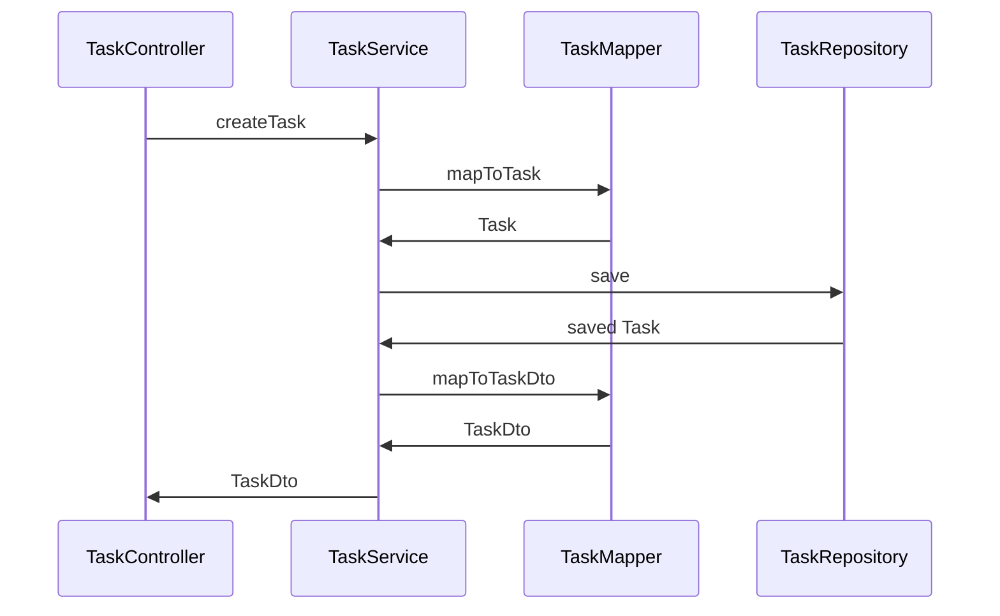

# Java and React course
This is still a work in progress.

## Description
This is built from following a tutorial that has a spring boot backend and react frontend.

## Technology used

### Backend application
- Java 17
- Spring Boot
- Spring JPA
- Spring Validation
- Spring Security
- JWT
- Lombok
- H2
- Flyway
- Mapstruct
- Open API

### Frontend
 - WIP

## Testing
- unit tests
- integration tests

### Create a task flow:

